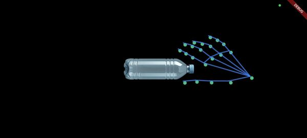
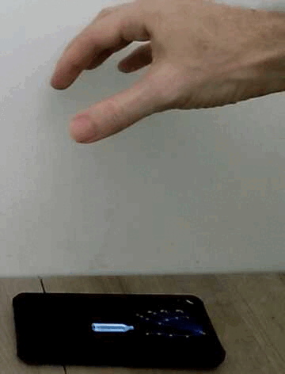

# Flutter Flame Hand Grasping Demo

[](https://opensource.org/license/MIT)

 

## 🚀 Features

* **Real-time Hand Tracking:** Utilizes the hand_landmarker plugin to detect and visualize hand landmarks from the device's camera feed.

* **Flame Game Integration:** Integrates hand tracking data into a Flame game environment, allowing for interactive gameplay.

* **Object Grasping:** Detects when the thumb tip and index finger tip are both "colliding" with a virtual water bottle, enabling a "grasping" mechanic.

* **Object Crushing:** When the thumb and index finger tips are touching each other while grasping the bottle, the bottle's sprite changes to a "crushed" state.

* **Responsive Hand Visualization:** Displays the detected hand skeleton and landmarks, dynamically updating their positions based on the camera input.

* **Camera Control:** Manages camera initialization and image stream processing for hand detection.

* **State Management:** Uses flutter_bloc for robust state management of the hand tracking process.

## 🛠️ Getting Started

These instructions will get you a copy of the project up and running on your local machine for development and testing purposes.

### Prerequisites

* Flutter SDK (version 3.8.1 or higher recommended)

* Android Studio or VS Code with Flutter and Dart plugins

* A physical Android device with a camera (iOS is not yet supported)

### Installation

1. **Clone the repository:**
    ```bash
    git clone https://github.com/IoT-gamer/flutter_flame_hand_grasping_demo.git
    cd flutter_flame_hand_grasping_demo
    ```

2. **Get dependencies:**
    ```bash
    flutter pub get
    ```

3. **Run the application:**

    Connect your Android device and run the app:
    ```bash
    flutter run
    ```
    Ensure you grant camera permissions when prompted on your device.

## ⚙️ How it Works

The application uses the `hand_landmarker` plugin, which leverages MediaPipe's Hand Landmarker model to detect hand keypoints.

1. `HandTrackingService`: Handles camera initialization, starts the camera image stream, and offloads hand landmark detection to a separate isolate using `integral_isolates` to prevent UI jank.

2. `HandTrackingCubit`: Manages the state of the hand tracking. It emits states like `HandTrackingInitial`, `HandTrackingLoading`, `HandTrackingSuccess` (with hand data), and `HandTrackingFailure`.

3. `HandGraspingGame` **(Flame Game)**:
    * Initializes the Flame game engine.
    * Contains `HandGraspingWorld`, which holds the game components.
    * `HandVisualizer`: Listens to the `HandTrackingCubit`'s state changes. When `HandTrackingSuccess` is emitted with hand data, it updates the positions of `HandLandmarkComponent` (circles representing landmarks) and `HandConnectionComponent` (lines connecting landmarks) to visualize the hand.
    * `WaterBottle`: A `SpriteComponent` that represents the interactive object. It has a `RectangleHitbox` to detect collisions with specific hand landmarks.
    * **Collision Detection:** The `INDEX_FINGER_TIP` and `THUMB_TIP` `HandLandmarkComponents` have `CircleHitboxes`. When these hitboxes collide with the `WaterBottle`'s hitbox, the game logic determines if the bottle is being "grasped" or "crushed."
    * **Grasping Logic:** The `WaterBottle` component tracks which finger tips are currently colliding with it. If both the index and thumb tips are colliding, the bottle's position is updated to follow the average position of these two landmarks, simulating a grasp.
    * **Crushing Logic:** A separate collision check between the `INDEX_FINGER_TIP` and `THUMB_TIP` `HandLandmarkComponents` determines if the fingers are touching each other. If they are, and the bottle is also being grasped, the `WaterBottle` sprite changes to its "crushed" version.

## 📂 Project Structure

```bash
lib/
  cubit/
    hand_tracking_cubit.dart    # BLoC for managing hand tracking state
    hand_tracking_state.dart    # States for HandTrackingCubit
  game/
    components/
      hand_connection_component.dart  # Visualizes connections between landmarks
      hand_landmark_component.dart  # Visualizes individual landmarks
      hand_visualizer.dart      # Orchestrates hand visualization
      line_component.dart       # Utility for drawing lines in Flame
      status.dart               # Displays status messages in-game
      water_bottle.dart         # The interactive water bottle object
    game.dart                   # Main Flutter widget for the Flame game
    hand_grasping_game.dart     # The core FlameGame class
  models/
    hand_connections.dart       # Defines hand landmark connections
    hand_landmark.dart          # Enum for hand landmark types
  services/
    hand_tracking_service.dart  # Handles camera and hand landmark detection
  main.dart                     # Entry point of the Flutter application
pubspec.yaml                    # Project dependencies and assets
```

## Assets

The game uses the following image assets:

* `assets/images/water_bottle.png`

* `assets/images/water_bottle_crushed.png`

Make sure these files are present in your `assets/images` directory and are correctly listed in `pubspec.yaml`.

## 📱 Platform Support

| Platform | Supported | Tested |
| :------- | :-------: | :----: |
| **Android**| ✅        | ✅     |
| **iOS** | 🚧        | ❌     |

## ❗ Troubleshooting

* Ensure you have the necessary permissions to access the camera.

* If `no hand detected` appears, try adjusting the lighting or moving your hand back from the camera or try slower motion.

* If grasping does not move the water bottle object, make sure the thumb and insex finger tip remains inside the water bottle's hitbox. Try slower motion.

## 🚧 Future Work / Known Issues

* **iOS Compatibility:** This demo is currently not compatible with iOS. Further development is needed to support hand tracking on iOS devices.

* **Performance Optimization:** While isolates are used for detection, further optimizations might be needed for very high frame rates or lower-end devices.

* **Multi-hand Support:** The current implementation primarily focuses on a single hand. Extending it to support multiple hands would involve iterating through all detected hands and managing their respective interactions.

## 🤝 Contributing
Contributions are welcome! Please feel free to open issues or submit pull requests.

## 📄 License
This project is licensed under the MIT License - see the `LICENSE` file for details.